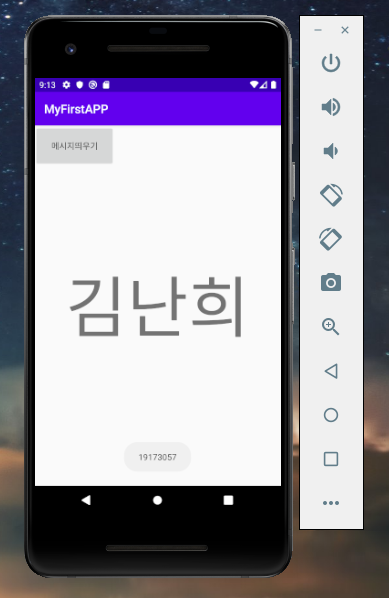
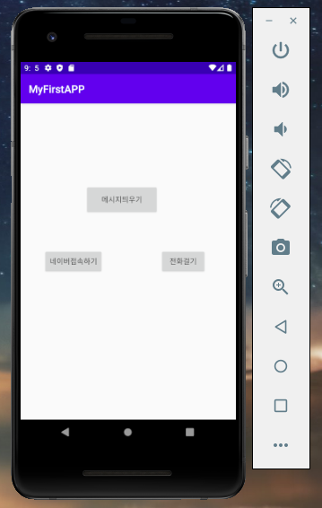
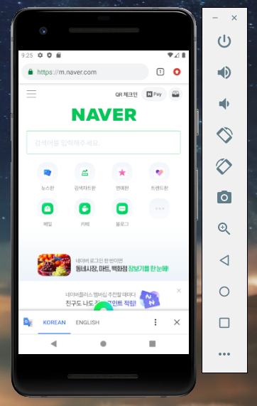
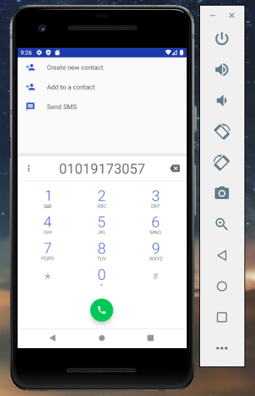

## IT비즈니스과 B반 19173057 김난희

### [캡스톤 디자인 2주차 과제]

</img>

### [캡스톤 디자인 3주차 과제]

</img>

</img>
</img>

### [캡스톤 디자인 4주차 과제]

</img>
- 아이디어 명 : 내 손안에 예산 지킴이 가계부 어플리케이션

- 계기 : 아직은 부모님한테 용돈을 받아서 생활하기 때문에 한 달 정해져 있는 용돈내에서 예산을 세우고 계획적으로 쓰는 소비 습관이 필요했습니다. 
 그래서 평소 스마트폰에 유명 가계부 어플리케이션인 뱅크샐러드의 예산 기능을 사용하여 한 달 동안의 예산을 정해놓고 가계부를 작성하며 효율적으로 관리해왔습니다. 
 불편함없이 1년정도 만족하며 계속 사용해왔는데, 최근에 뱅크샐러드가 전체적으로 ux/ui 및 기능을 개편하면서 자주 사용하던 예산 기능에서 문제가 발생하였습니다. 
 기존에 있던 예산 금액을 설정할 때 숫자 키패드에 있던 계산기 기능을 삭제하는 바람에 일일이 가계부 앱을 종료하고 계산기 앱을 켜서 계산해야 하는 번거로움이 발생했고,
 원래는 색으로 초과/적당/여유을 구분하여 한 눈에 봤을 때 구분이 바로 가능하여 편리했는데 업데이트 후 적당과 초과의 색을 동일하게 빨간색으로 설정하여 딱 봤을때 구분하기 어렵고, 
 정말 작게 써져있는 백분율 숫자를 봐야만 구분이 가능하고 폰트 사이즈가 작아져 가독성이 심하게 떨어져 불편함을 느꼈습니다. 또한 예산 설정을 하지 않은 카테고리면 아예 예산 항목에 반영이      
 안되는 바람에 알고 봤더니 설정한 예산보다 더 많이 쓰는 경우도 발생하여 예산을 설정한 보람이 없어지기도 했습니다. 그래서 아예 다른 가계부 어플리케이션을 사용하려고 찾아봤는데
 가계부 관련 앱은 많은데, '예산'을 정하고 '예산'만 집중적으로 관리하는 어플리케이션의 수는 상대적으로 매우 적은 편에 속했고 기존에 있던 예산 관리 앱이나 가계부 앱 내에 있던
 예산 관리 기능은 가독성이나 예산 관리 능력이 현저히 떨어지는 경우가 많아서 이용하는데 불편한 경우가 다소 있어 큰 메리트를 느끼지 못하여 '내가 쓰기 편한 예산 관리 집중 가계부 앱을
 만들어보면 어떨까?' 해서 고안하게 되었습니다. 
         
- 구현하고 싶은 내용 :
1) 복잡하지 않고, 읽기 쉬운 폰트 사이즈. 가독성이 높아 학생 ~ 어른누구나 사용하기 좋은 플랫폼
2) 딱 한 눈에 봤을 때 자기가 예산안에서 얼만큼 사용했는지 바로 파악이 가능한 구조
3) 주기적으로 예산 범위내에서 지금까지 얼마나 사용했는지 팝업 알림 기능.
4) 기본적인 가계부 기능
5) 캘린더, 원형그래프, 카테고리별 분석 자료 등의 지표를 활용한 정보 제공
6) 미션(챌린지)참여 기능을 추가하여 사용자의 동기부여 촉진
7) 칭찬 및 잔소리 알림
8) 앱 내 모든 키패드에 계산기 기능
         
  
         
